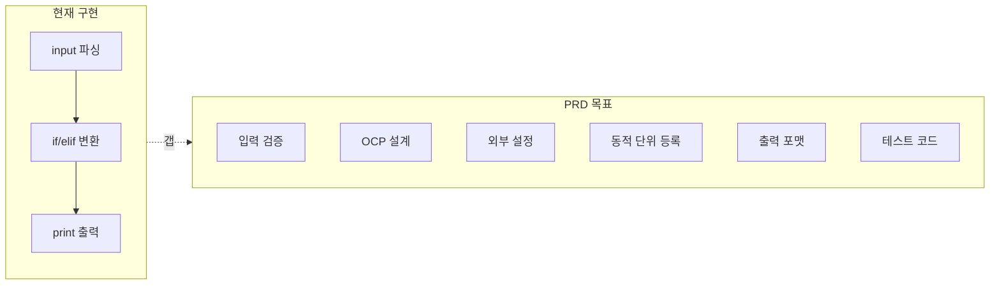
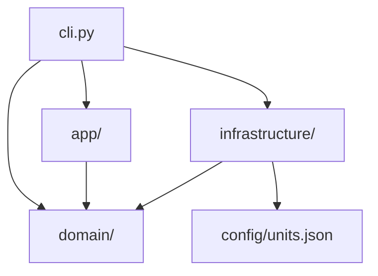
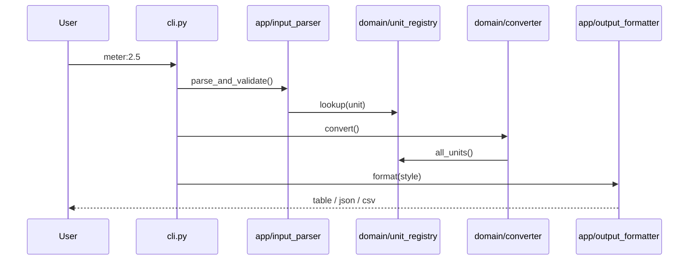

# UnitConvertor_21 — 리팩터링 Plan

**작성일:** 2026-06-11  
**갱신:** 2026-06-11 (Activity 2~5 완료 반영)  
**프로젝트:** UnitConvertor_21  
**상태:** Activity 1~5 완료 · Mom Test · UX·YAML 보강 · pytest 36 passed  
**PRD:** [docs/PRD.md](../docs/PRD.md)  
**관련:** [Report/01](../Report/01_레거시분석-아키텍처-Plan수립.md) · [Report/08](../Report/08_Mom-Test-UX검증.md)

---

## 개요

레거시 [UnitConverter.py](../UnitConverter.py)를 **Target Architecture** 기준으로 리팩터링한다.

- **OCP:** `LengthUnit` Protocol + `UnitRegistry` — `converter.py` 수정 없이 단위 확장
- **SRP:** Parser / Registry / Converter / Formatter / Config Load / CLI 분리
- **FR 7건 · NFR 7건** 매핑 및 README Activities 2~4단계 충족

---

## 구현 Todo

- [x] **2단계 domain/** — `length_unit.py`, `unit_registry.py`, `converter.py`, `exceptions.py`
- [x] **2단계 app/cli** — `app/input_parser.py`, `cli.py`, `__main__.py` (FR-01~04, NFR-01~03)
- [x] **Mom Test 확인** — 2단계 완료 후 (§6) → [Report/08](../Report/08_Mom-Test-UX검증.md)
- [x] **3단계 TC** — `tests/test_converter.py` (Track B), `tests/test_cli.py` (Track A)
- [x] **4단계 infra** — `infrastructure/config_loader.py`, `config/units.json` (FR-06)
- [x] **4단계 app 확장** — `registration_parser.py`, `output_formatter.py` (FR-05, FR-07)
- [x] **Mom Test 확인** — 4단계 완료 후 (§6) → [Report/08](../Report/08_Mom-Test-UX검증.md)
- [x] **(선택)** `UnitConverter.py` → `cli.main()` thin wrapper
- [x] **(추가)** Golden Master 7건 · GUI · A-12/A-13 · GUI smoke test

---

## 현재 상태 요약 (2026-06-11 갱신)

Target Architecture 구현 완료. FR-01~07 · NFR-01~07 충족. `python -m pytest` **36 passed** (Track A 15 + B 10 + GM 7 + GUI smoke 4).

| 항목 | 상태 |
|------|------|
| domain / app / infrastructure / cli | ✅ |
| config/units.json | ✅ |
| Golden Master | ✅ 7건 |
| Mom Test | ✅ Report/08 |
| UX 보강 | ✅ Report/09 (UX-001~004) |
| YAML config | ✅ `config/units.yaml` |
| GUI | ✅ `unit_converter/gui.py` + smoke test |

> 아래 §1~§5는 **1단계 분석 당시 스냅샷**이다. 레거시 스멜·갭 분석 기록으로 유지한다.

---

## 현재 상태 요약 (1단계 분석 시점 — 아카이브)

프로젝트는 **단일 스크립트 37줄**([UnitConverter.py](../UnitConverter.py))만 존재하며, 테스트·설정 파일·클래스 구조가 없습니다. README 요구 대비 **기본 변환만 동작**, 품질/추가 요구는 **대부분 미구현**.



---

## 1. 레거시 코드 스멜 (16건)

### 구조 / 설계

| # | 스멜 | 위치 | 설명 |
|---|------|------|------|
| 1 | **God Function / SRP 위반** | `main()` 전체 | 파싱, 검증, 변환, 출력 혼재 |
| 2 | **OCP 위반** | L16–24, L26–32 | 새 단위 시 if/elif + 출력 동시 수정 |
| 3 | **절차적 스크립트** | 파일 전체 | 인터페이스·클래스·모듈 분리 없음 |
| 4 | **관심사 미분리** | `main()` | CLI / 도메인 / 표현 레이어 없음 |

### 코드 품질

| # | 스멜 | 위치 | 설명 |
|---|------|------|------|
| 5 | **Magic Number** | L19–21, L27–28 | `3.28084`, `1.09361` 하드코딩 |
| 6 | **DRY 위반** | L16–32 | 비율 중복 정의 |
| 7 | **확장 불가능한 분기** | L16–24 | if/elif 선형 증가 |
| 8 | **테스트 불가능한 구조** | `main()` + `input()` | stdin/print 결합 |

### 입력 / 출력 · 프로젝트

| # | 스멜 | 설명 |
|---|------|------|
| 9 | 불완전한 입력 검증 | 음수 미검증 |
| 10 | 공백 미처리 | `" meter:2.5 "` 오류 |
| 11 | 출력 정밀도 불일치 | PRD는 반올림, 코드는 raw float |
| 12 | 출력 의미 모호 | 동일 단위도 출력 |
| 13–16 | 기타 | 표기 불일치, 테스트 부재, 설정 부재, README 이미지 |

### 1.1 레거시 스멜 → Target 모듈 매핑

| 스멜 # | 현재 문제 | Target Architecture 해소 |
|--------|-----------|--------------------------|
| 1, 4 | God Function | `cli.py` 조립 / `domain`·`app` 분리 |
| 2, 7 | OCP 위반 | `unit_registry.py` + `length_unit.py` |
| 3 | 절차적 스크립트 | `domain/` / `app/` / `infrastructure/` |
| 5, 6 | Magic Number·DRY | `config/units.json` → `config_loader` |
| 8, 14 | 테스트 불가·부재 | Track B/A 테스트 |
| 9, 10 | 검증·공백 | `app/input_parser.py` |
| 11, 12 | 출력 이슈 | `app/output_formatter.py` |
| 15 | 설정 부재 | `infrastructure/config_loader.py` |

---

## 2. PRD 갭

| 구분 | 상태 |
|------|------|
| 기본 요구 | 2건 부분 충족, 2건 미충족 |
| 품질 요구 | OCP/SRP 미충족, 검증 부분 충족 |
| 추가 요구 | 설정 외부화·동적 등록·출력 포맷 전부 미구현 |
| Activities 2~4 | 미달 |

---

## 3. Target Architecture — 패키지 구조

> 교육 자료 **Target Architecture (Python)** 슬라이드 기준. FR-05·NFR-03을 위해 `app/`에 파일 2개 보강.

```
UnitConvertor_21/
├── unit_converter/
│   ├── __init__.py
│   ├── __main__.py
│   ├── cli.py
│   ├── domain/
│   │   ├── length_unit.py          # Protocol (name, to_meter)
│   │   ├── unit_registry.py        # OCP 핵심
│   │   ├── converter.py            # meter 허브 변환
│   │   └── exceptions.py
│   ├── infrastructure/
│   │   └── config_loader.py        # JSON / YAML
│   └── app/
│       ├── input_parser.py
│       ├── output_formatter.py
│       └── registration_parser.py  # FR-05
├── config/units.json
├── tests/
│   ├── test_converter.py           # Track B — Domain
│   └── test_cli.py                 # Track A — Boundary
└── UnitConverter.py                # thin wrapper (선택)
```

### OCP

```
새 단위 =
  (A) LengthUnit 구현 + registry.register()
  (B) units.json 1줄 추가 → config_loader 시드
→ converter.py 수정 금지
```

### SRP — 4대 책임

| 책임 | 모듈 |
|------|------|
| Parser | `app/input_parser.py` |
| Registry | `domain/unit_registry.py` |
| Converter | `domain/converter.py` |
| Formatter | `app/output_formatter.py` |
| Config Load | `infrastructure/config_loader.py` |
| CLI | `cli.py` |

### 레이어 의존



### config/units.json

```json
{
  "base_unit": "meter",
  "units": {
    "meter": 1.0,
    "feet": 3.28084,
    "yard": 1.09361
  }
}
```

비율: `1 {unit} = {ratio} meter`

### 실행

```bash
python -m unit_converter
python -m unit_converter --format json
python UnitConverter.py
```

---

## 4. FR / NFR 매핑

### Functional Requirements

| ID | 요구사항 | 담당 모듈 |
|----|----------|-----------|
| FR-01 | `단위:값` 파싱 | `app/input_parser.py` |
| FR-02 | 모든 단위 변환 출력 | `domain/converter.py` + `app/output_formatter.py` |
| FR-03 | meter/feet/yard | `config/units.json` + `domain/unit_registry.py` |
| FR-04 | meter 기준 비율 | `domain/length_unit.py` + `domain/converter.py` |
| FR-05 | 동적 단위 등록 | `app/registration_parser.py` + `unit_registry.py` |
| FR-06 | JSON/YAML 설정 | `infrastructure/config_loader.py` |
| FR-07 | 출력 포맷 선택 | `app/output_formatter.py` + `cli.py` |

### Non-Functional Requirements

| ID | 요구사항 | 충족 방식 |
|----|----------|-----------|
| NFR-01 | OCP | LengthUnit + Registry, converter 불변 |
| NFR-02 | SRP | 4대 책임 분리 |
| NFR-03 | 입력 검증 | `app/input_parser.py` |
| NFR-04 | TC | Track B + Track A |
| NFR-05 | 테스트 가능 | domain I/O 무관 |
| NFR-06 | DRY | units.json 단일 출처 |
| NFR-07 | CLI·도메인 분리 | `cli.py` 조립만 |

### 데이터 흐름



---

## 5. 구현 체크리스트 (Activities)

### Activity 2 — 기본+품질

- [x] `domain/length_unit.py`
- [x] `domain/unit_registry.py`
- [x] `domain/converter.py` (if/elif 없음)
- [x] `domain/exceptions.py`
- [x] `app/input_parser.py`
- [x] `cli.py` + `__main__.py`
- [x] Mom Test 진행 여부 확인 → Report/08

### Activity 3 — TC

- [x] `tests/test_converter.py` (Track B)
- [x] `tests/test_cli.py` (Track A)

### Activity 4 — 추가 요구

- [x] `config/units.json` + `infrastructure/config_loader.py`
- [x] `app/registration_parser.py`
- [x] `app/output_formatter.py` + `--format`
- [x] 추가 TC (A-12, A-13, GUI smoke)
- [x] Mom Test 진행 여부 확인 → Report/08

---

## 6. Mom Test 체크포인트

| 시점 | 판단 |
|------|------|
| 1단계 (현재) | **불필요** |
| 2단계 완료 후 | **확인 필요** — CLI·에러 메시지 UX |
| 3단계 완료 후 | 보통 SKIP |
| 4단계 완료 후 | **확인 필요** — 포맷·동적 등록 UX |

**진행(YES):** CLI/메시지/출력을 처음 만들거나 크게 변경했을 때  
**SKIP:** domain 내부만 변경, pytest로 충분할 때

---

## 7. 결론 · 다음 실행 순서

| 구분 | 요약 |
|------|------|
| 레거시 스멜 | 16건 |
| PRD 충족도 | 약 30% (변환 로직만) |
| 제안 구조 | domain / app / infrastructure / cli |

**다음:** Activity 5 회고·발표 — (선택) UX-001~004 메시지 개선
